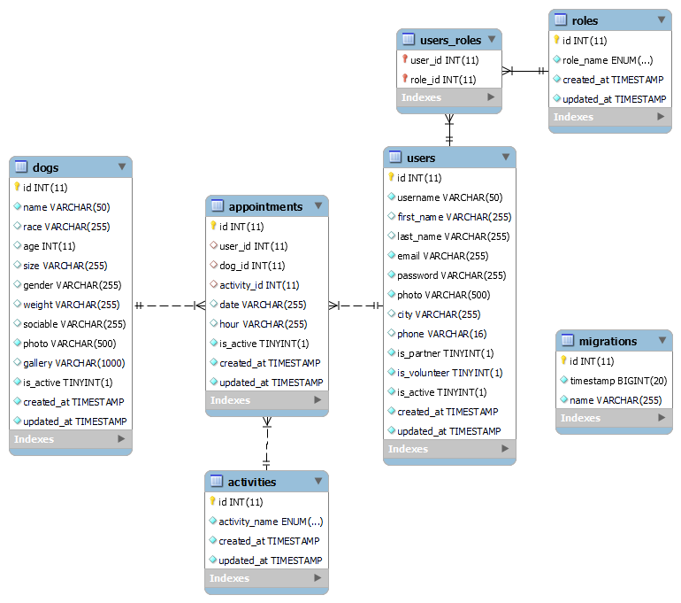

# WetSnout BackEnd

<details>
  <summary>Contenido 📝</summary>
  <ol>
    <li><a href="#objetivo">Objetivo</a></li>
    <li><a href="#sobre-el-proyecto">Sobre el proyecto</a></li>
    <li><a href="#stack">Stack</a></li>
    <li><a href="#diagrama-bd">Diagrama</a></li>
    <li><a href="#instalación-en-local">Instalación</a></li>
    <li><a href="#endpoints">Endpoints</a></li>
    <li><a href="#contribuciones">Contribuciones</a></li>
    <li><a href="#webgrafia">Webgrafia</a></li>
    <li><a href="#agradecimientos">Agradecimientos</a></li>
    <li><a href="#contacto">Contacto</a></li>
  </ol>
</details>

## Objetivo
Este proyecto requería una API funcional conectada a una base de datos relacional.

## Sobre el proyecto
El proyecto consta de un aplicación web para la gestión de una protectora de animales. En esta aplicación los usuarios interesados pueden registrarse, ver la ficha de los perros y pueden agendar un paseo con el perro seleccionado, pueden editar sus datos, y desactivar (eliminar) las reservas en caso de no querer/poder ir al encuentro.
Además la aplicación permite a los usuarios con privilegios  registrar animales, editar el estado de las citas y ver cuantas hay.
Los super_admin, pueden cambiar de role a los usuarios y pueden cambiar el estado de los usuarios de activos a inactivos. 
El objetivo del proyecto es crear un backend para la aplicación "Wetsnout", que permita realizar todas estás operaciones desde el frontend.


## Stack
Tecnologías utilizadas:
[](https://developer.mozilla.org/en-US/docs/Web/JavaScript) [](https://developer.mozilla.org/en-US/docs/Web/API/Node) [](https://expressjs.com/) [](https://dev.mysql.com/doc/) [](https://jwt.io/introduction) [](https://developer.mozilla.org/en-US/docs/Glossary/Git)


## Diagrama BD


## Instalación en local
1. Clonar el repositorio
2. ` $ npm install `
3. Conectamos nuestro repositorio con la base de datos 
4. ``` $ Ejecutamos las migraciones ``` 
5. ``` $ Ejecutamos los seeders ``` 
6. ``` $ npm run dev ``` 
7. ...

## Endpoints

Puedes  ver todos los endpoints disponibles en [este archivo](./WetSnout.postman_collection.json) que puedes descargar e importar directamente a Postman.

## Contribuciones
Las sugerencias y aportaciones son siempre bienvenidas.  

Puedes hacerlo de dos maneras:

1. Abriendo una issue
2. Crea un fork del repositorio
    - Crea una nueva rama  
        ```
        $ git checkout -b feature/nombreUsuario-mejora
        ```
    - Haz un commit con tus cambios 
        ```
        $ git commit -m 'feat: mejora X cosa'
        ```
    - Haz push a la rama 
        ```
        $ git push origin feature/nombreUsuario-mejora
        ```
    - Abre una solicitud de Pull Request


## Webgrafia:
Para conseguir mi objetivo he recopilado información de mi proyecto anterior:
https://github.com/AkireOrl/Proyecto4BootCamp


## Agradecimientos:

Agradezco a mis compañeros el tiempo dedicado a este proyecto y a los profesores de [GeeksHubsAcademy_](https://geekshubsacademy.com/) que nos han guiado en el camino 🤗:

- **Gabe**  
<a href="https://github.com/GabrielEscudillo" target="_blank"></a> 

- **Hector**  
<a href="https://www.github.com/userGithub/" target="_blank"></a> 

## Contacto
<a href = "mailto:om.erikaorlando@gmail.com"></a>
<a href="https://www.linkedin.com/in/erika-orlando/" target="_blank"></a> 
</p>